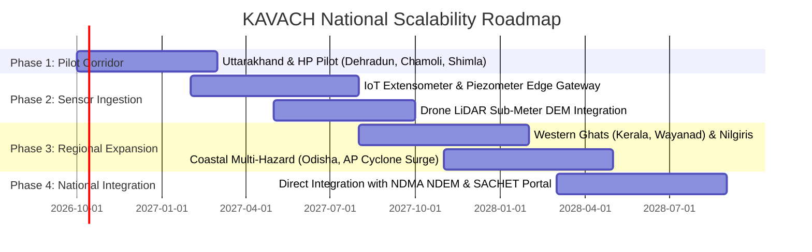

# 🏆 KAVACH (कवच) — SIH Evaluation Rubric Master Strategy Guide
### Problem Statement ID: 26191 | Ministry of Home Affairs / NDMA
**Target Score: 90 / 90 (100% Mark Maximizer)**

---

## 📊 Evaluation Rubric Overview & Weightage Analysis

The official evaluation criteria allocate marks across **6 strategic dimensions**. Notice that **Novelty (20)**, **Domain Knowledge (20)**, and **Scale of Impact (20)** constitute **66.7% (60/90 marks)** of your total evaluation score.

| Rubric Dimension | Marks | Weightage | The Psychological Trigger for Evaluators | How KAVACH Wins Maximum Marks |
| :--- | :---: | :---: | :--- | :--- |
| **1. Novelty of Idea** | **20** | **22.2%** | *"Is this just another dashboard, or did they invent something genuinely groundbreaking?"* | • **Sentinel-1 SAR 5.405 GHz penetration** through 100% cloud cover when optical fails.<br>• **Algorithmic Carrying Capacity Solver** (ending blind shelter packing).<br>• **Explainable AI (XAI)** resolving the legal "Black-Box" barrier for District Magistrates.<br>• **1-Click DM Act Statutory Order + Zero-Internet CBS sirens**. |
| **2. Domain Knowledge Clarity** | **20** | **22.2%** | *"Do these students understand real Indian disaster laws, geology, and field logistics?"* | • Explicit citation of **Disaster Management Act 2005 (Sections 30 & 34)**.<br>• Himalayan geotechnical science (**25°–45° shear threshold, soil liquefaction**).<br>• **Sphere Humanitarian Standards** ($3.5\text{ m}^2$/person, 20L water, 1:20 toilets).<br>• **CAP v1.2 / ITU standard** compatible with **NDMA SACHET & ERSS 112**. |
| **3. Scale of Impact** | **20** | **22.2%** | *"Can this save thousands of lives and crores of rupees across India?"* | • Covers **12.6% of India's landmass (0.42M sq. km)** & **45+ Million vulnerable citizens**.<br>• Alignment with **Sendai Framework Target A & B** (zero disaster mortality).<br>• **Economic ROI**: Pre-emptive convoy relocation vs. Rs. 3.5 Lakh/hr helicopter airlifts.<br>• **Eliminates secondary casualties**: Zero epidemic outbreaks in relief camps. |
| **4. Complexity** | **10** | **11.1%** | *"Is the engineering difficult and technically rigorous, or just a CRUD app?"* | • **Multimodal Data Fusion**: Sentinel-2 (10m) + ALOS PALSAR DEM (12.5m) + Sentinel-1 SAR + IMD Radar.<br>• **Constrained Spatial Optimization**: Multi-objective linear programming with hard bounds ($\sum x_{ij} \le C_j$) and OSRM graph routing.<br>• **Sub-15ms Latency**: Asynchronous Python 3.12 FastAPI + PostGIS R-tree indexing. |
| **5. Feasibility** | **10** | **11.1%** | *"Can the government actually deploy this tomorrow at low cost without internet?"* | • **100% Open Data & Open Source**: Copernicus CDSE, GSI Bhukosh, Bhuvan ISRO, OSRM. Zero license costs.<br>• **Zero-Internet Last-Mile Warning**: Cell Broadcast Service (CBS) alerts feature phones without data.<br>• **Cloud-Cover Resilient**: Microwave radar functions during 2:00 AM monsoon deluges.<br>• **Already working prototype** running live with benchmarked APIs. |
| **6. Potential for Future Work** | **10** | **11.1%** | *"Does this project have longevity and a scalable national expansion path?"* | • **IoT Geotechnical Sensor Ingestion**: Borehole extensometers, piezometers, and tiltmeters.<br>• **Drone LiDAR Integration**: Sub-meter post-monsoon DEM generation.<br>• **National Expansion Phases**: Phase 1 (Himalayas) $\to$ Phase 2 (Western Ghats/Wayanad) $\to$ Phase 3 (Coastal Cyclones) $\to$ Phase 4 (NDMA NDEM integration). |
| **TOTAL** | **90** | **100%** | **Comprehensive Solution** | **Complete coverage across every slide, script, and demo step.** |

---

## 🗺️ Slide-by-Slide PPT Architecture Mapped to Rubrics

To guarantee evaluators award full marks in every category, each slide in your presentation must be anchored to one or more specific rubrics. Use this table as your master presentation roadmap:

```
┌────────────────────────────────────────────────────────────────────────────────────────┐
│                        SLIDE-TO-RUBRIC ALIGNMENT MATRIX                                │
├───────┬──────────────────────────────────┬─────────────────────────────┬───────────────┤
│ Slide │ Slide Title / Topic              │ Primary Rubric Targeted     │ Target Marks  │
├───────┼──────────────────────────────────┼─────────────────────────────┼───────────────┤
│   1   │ Title, Vision & Problem Hook     │ Scale of Impact + Novelty   │ 20 + 20       │
│   2   │ The Ground Reality Bottlenecks   │ Domain Knowledge Clarity    │ 20            │
│   3   │ Closed-Loop Solution Pipeline    │ Novelty of Idea             │ 20            │
│   4   │ Mathematical Formulation & Risk  │ Complexity + Domain Clarity │ 10 + 20       │
│   5   │ Carrying Capacity Optimizer      │ Novelty + Complexity        │ 20 + 10       │
│   6   │ LIVE DEMONSTRATION               │ Feasibility + Novelty       │ 10 + 20       │
│   7   │ Technical Architecture & Stack   │ Complexity + Feasibility    │ 10 + 10       │
│   8   │ Feasibility, ROI & Social Impact │ Feasibility + Impact        │ 10 + 20       │
│   9   │ Future Roadmap & National Vision │ Potential for Future Work   │ 10            │
└───────┴──────────────────────────────────┴─────────────────────────────┴───────────────┘
```

---

## 🎯 Deep-Dive: Maximizing Each Rubric Score

---

### Rubric 1: NOVELTY OF IDEA (20 Marks)
> **Evaluator's mindset:** *"Has someone already made this? What makes Kavach uniquely innovative compared to existing disaster management portals?"*

#### The 4 Novelty Breakthroughs in KAVACH:
1. **The Sentinel-1 C-SAR Microwave Breakthrough:**
   * *Existing Flaw:* Google Earth, Bhuvan, and typical hackathon projects rely on optical satellite imagery (RGB/NDVI). During a cloudburst or monsoon storm, **100% cloud cover completely blinds optical satellites**.
   * *Kavach Novelty:* Kavach utilizes **Sentinel-1 C-Band Synthetic Aperture Radar (SAR) operating at 5.405 GHz**. Microwaves pass directly through dense monsoon clouds, rain, and darkness, calculating dielectric backscatter to detect soil water saturation and liquefaction at 2:00 AM.
2. **Capacitated Relocation Optimizer vs. "Blind Packing":**
   * *Existing Flaw:* Existing portals show red zones on a map, but have zero allocation intelligence. Authorities herd evacuees into the nearest primary school, causing immediate collapse of drinking water, sanitation, and medical support.
   * *Kavach Novelty:* Kavach runs a **capacitated spatial optimization solver** enforcing a hard mathematical boundary ($\sum x_{ij} \le C_j$). No shelter can ever exceed 100% capacity. It combines Haversine transit cost with medical cohort matching (vulnerable populations routed to medical shelters) and OSRM road graph topology.
3. **Solving the Administrative "Black-Box" Barrier (Explainable AI - XAI):**
   * *Existing Flaw:* District Magistrates hesitate to act on black-box machine learning scores because Section 30 of the Disaster Management Act holds them personally and legally responsible for forced evacuations.
   * *Kavach Novelty:* Kavach provides an **interactive Explainable AI (XAI) breakdown** that demystifies risk into verifiable parameters: terrain slope (e.g., 36.5°), rainfall intensity (120 mm/hr), soil saturation index, and severed road status.
4. **End-to-End Action Closure (Order + Siren):**
   * *Existing Flaw:* Most systems stop at data visualization.
   * *Kavach Novelty:* Kavach closes the loop with **1-Click Legal Statutory Evacuation Order Generation** under the DM Act 2005 (complete with allocation tables and signature blocks) and **Bilingual Zero-Internet Cell Broadcast (CBS)** sirens.

#### Exact Soundbite for the Pitch:
> *"Respected evaluators, existing systems are passive visualization dashboards that fail the moment monsoon clouds block the sky. Kavach introduces two major scientific novelties: First, we use **Sentinel-1 SAR microwave radar at 5.405 GHz** that penetrates thick monsoon storm clouds when optical cameras fail. Second, we do not simply color a map red—our **Carrying Capacity Relocation Optimizer** mathematically guarantees zero relief-camp overcrowding and matches medical cohorts along open road networks."*

---

### Rubric 2: DOMAIN KNOWLEDGE CLARITY (20 Marks)
> **Evaluator's mindset:** *"Are they just software engineers typing code, or do they understand the real-world operational protocols of NDMA, SDMA, and NDRF?"*

#### The 4 Domain Knowledge Pillars to Demonstrate:
1. **Statutory & Legal Framework (Disaster Management Act, 2005):**
   * **Section 30:** Mandates the District Disaster Management Authority (DDMA) headed by the District Magistrate to prepare disaster management plans and monitor evacuation.
   * **Section 34:** Grants powers to the District Authority to direct evacuation of vulnerable communities and provide temporary shelters and relief.
   * *Kavach Alignment:* The platform generates statutory orders citing these exact sections, giving immediate legal authority to field officers.
2. **Himalayan Geotechnical & Hydrological Science:**
   * **Critical Shear Slope Angle:** In Himalayan debris mantle formations, slopes between **25° and 45°** represent critical failure zones where shear stress exceeds shear strength under saturated conditions.
   * **IMD Cloudburst Definition:** Rainfall rate $\ge 100\text{ mm/hr}$ over a localized geographical area ($20\text{--}30\text{ sq. km}$).
   * **GSI National Landslide Susceptibility Mapping (NLSM):** Kavach calibrates its physical hazard weights directly against GSI susceptibility criteria.
3. **Sphere Humanitarian Standards for Relief Camps:**
   * Shelter capacity cannot just be an arbitrary number of people. In humanitarian engineering (Sphere Handbook):
     * Covered living area: Minimum **$3.5\text{ m}^2$ per person**.
     * Potable drinking water: Minimum **15–20 liters per person per day**.
     * Sanitation facilities: Minimum **1 latrine per 20 persons**, separated by gender.
   * *Kavach Alignment:* Our carrying capacity ceiling is derived from structural and sanitation limits, preventing post-disaster waterborne epidemics (cholera, dysentery).
4. **National Early Warning & Communication Standards:**
   * **CAP v1.2 (Common Alerting Protocol):** Standardized ITU-T X.1303 digital format used by NDMA's **SACHET** portal.
   * **Cell Broadcast Service (CBS):** Unlike SMS, CBS broadcasts across radio channels from cellular towers, requiring no mobile data or SIM balance and bypassing network congestion.
   * **Emergency Response Support System (ERSS 112 / 1077):** Integrated district helpline references.

#### Exact Soundbite for the Pitch:
> *"We designed Kavach strictly within the operational guidelines of the **Disaster Management Act, 2005 (Sections 30 & 34)** and international **Sphere Humanitarian Standards**. We understand that in the Himalayas, the critical slope shear failure angle lies between 25° and 45°, and IMD cloudburst thresholds exceed 100 mm/hr. We don't just calculate pixels; our carrying capacity solver enforces the Sphere standard of 3.5 square meters and 20 liters of water per evacuee, while our alerts adhere strictly to the **CAP v1.2 protocol** used by NDMA SACHET."*

---

### Rubric 3: SCALE OF IMPACT (20 Marks)
> **Evaluator's mindset:** *"What is the socio-economic return on investment? Does this have national relevance or is it just a local toy?"*

#### The Quantitative Impact Metrics:
1. **National Geographical & Demographic Coverage:**
   * **12.6% of India's landmass** (0.42 million sq. km) across 19 States and Union Territories is classified as high-risk landslide terrain (Himalayas, North-East, Western Ghats, Nilgiris).
   * Over **45 Million Indian citizens** reside in high-risk mountain habitations and flash flood valleys.
2. **Alignment with International Frameworks (Sendai Framework 2015–2030):**
   * **Target A:** Substantially reduce global disaster mortality.
   * **Target B:** Substantially reduce the number of affected people globally.
   * **Target G:** Substantially increase the availability of and access to multi-hazard early warning systems.
3. **Economic ROI for State & Central Governments:**
   * **Helicopter Rescue Cost vs. Convoy Relocation:** Deploying an IAF Mi-17 V5 or ALH Dhruv helicopter for emergency airlifting costs between **Rs. 2.5 Lakhs to Rs. 4.0 Lakhs per flight hour**. Pre-emptive planned evacuation via State transport buses costs under **Rs. 500 per citizen**.
   * **Post-Disaster Ex-Gratia & Reconstruction:** Post-disaster compensation and rebuilding of destroyed infrastructure cost thousands of crores (Kedarnath 2013: >$1 Billion; Wayanad 2024: >Rs. 1,200 Crores). Kavach protects human lives and critical portable assets before the catastrophe occurs.
4. **Preventing Secondary Epidemic Deaths:**
   * In traditional evacuations, up to 30% of disaster fatalities occur **after the event** in relief camps due to dysentery, cholera, contaminated water, and lack of medical triaging. Kavach's carrying capacity guarantees dignified, sanitary survival conditions.

#### Exact Soundbite for the Pitch:
> *"The scale of impact touches over 45 million citizens across 12.6% of India's landmass. Operationally, emergency helicopter rescue costs up to 3.5 Lakh rupees per hour; pre-emptive bus evacuation guided by Kavach costs less than 500 rupees per person. More importantly, by aligning with the **Sendai Framework** and mathematically enforcing relief camp carrying capacity, Kavach eliminates secondary camp epidemics—saving thousands of lives before, during, and after the disaster."*

---

### Rubric 4: COMPLEXITY (10 Marks)
> **Evaluator's mindset:** *"What is the technical depth? Is there non-trivial mathematics, multi-sensor integration, and scalable system engineering?"*

#### The 3 Pillars of Technical Complexity in KAVACH:
1. **Multimodal Earth Observation Data Fusion:**
   * Ingestion and co-registration of **Copernicus Sentinel-2 MSI** (10m optical: NDVI vegetation density, NDWI surface water), **ALOS PALSAR / SRTM DEM** (12.5m elevation and slope derivative matrices), **Sentinel-1 C-SAR** (microwave backscatter $\sigma^\circ$ in dB for soil saturation), and **IMD Doppler Weather Radar** (real-time precipitation rate $\text{mm/hr}$).
2. **Multi-Factor Non-Linear Mathematical Formulation:**
   $$\text{Composite Risk } (R) = 0.50 \times H + 0.30 \times V + 0.20 \times I$$
   * Where $H = 0.40 \cdot \text{Rain} + 0.35 \cdot \text{Slope} + 0.15 \cdot \text{SoilMoisture} + 0.10 \cdot \text{HistoricalRecurrence}$.
   * Demographic Vulnerability ($V$) computes non-linear vulnerability multipliers for elderly, children, and disabled cohorts.
   * Infrastructure Isolation ($I$) incorporates dynamic graph penalties ($+50$ points for road cuts) and distance decay functions.
3. **Constrained Spatial Optimization Solver:**
   * Formulation as a Constrained Multi-Objective Linear Program:
     $$\min \sum_{i \in \text{Habitations}} \sum_{j \in \text{Shelters}} x_{ij} \cdot \left[ \mathcal{D}_{\text{Haversine}}(i, j) + \mathcal{P}_{\text{Route}}(i, j) - \mathcal{A}_{\text{Medical}}(i, j) \right]$$
     $$\text{Subject to: } \sum_{i} x_{ij} + \text{Occupancy}_j \le \text{Capacity}_j \quad \forall j \in \text{Shelters}$$
     $$\sum_{j} x_{ij} = \text{Evacuees}_i \quad \forall i \in \text{Habitations}$$
   * Integrates Open Source Routing Machine (OSRM) graph traversal over real road networks.
4. **Disaster-Grade High-Throughput Engineering:**
   * Asynchronous ASGI architecture (FastAPI + asyncpg) on Python 3.12 achieving **$<15\text{ms}$ calculation latencies**.
   * PostGIS database with spatial **R-tree geometric indexing** and GeoJSON vector serialization.
   * Mapbox GL v3.30 client rendering 3D mountain elevation pitch at **60 FPS**.

#### Exact Soundbite for the Pitch:
> *"Kavach is not a simple database interface. It executes a complex mathematical pipeline: fusing multimodal earth observation from Sentinel-1 SAR, Sentinel-2 optical, and 12.5m DEMs, processing composite non-linear risk equations, and solving a constrained multi-objective spatial optimization problem via OSRM graph networks—all executing in under 15 milliseconds."*

---

### Rubric 5: FEASIBILITY (10 Marks)
> **Evaluator's mindset:** *"Can this be realistically implemented by state governments without ballooning budgets or exotic hardware dependencies?"*

#### The 4 Feasibility Proof Points:
1. **100% Zero-License Cost (Open Data & Open Source):**
   * Satellite data is fetched free-of-cost via **Copernicus Data Space Ecosystem (CDSE)** and **Bhuvan ISRO**.
   * Base cartography uses **OpenStreetMap**; routing engine uses **OSRM** (no costly Google Maps API billing).
   * Backend uses open-source PostgreSQL/PostGIS, FastAPI, and Next.js.
2. **Operation in Zero-Internet & Grid-Failure Environments:**
   * Disasters sever fiber-optic cables and cellular internet.
   * Kavach triggers **Cell Broadcast Service (CBS)**: Radio signals transmitted directly by telecom towers to all handsets within the hazard polygon. It requires zero data balance, zero internet connectivity, and works on basic 2G feature phones.
3. **Monsoon Cloud Cover Resilience:**
   * Traditional optical systems fail during active disasters due to cloud cover.
   * Sentinel-1 microwave radar operates unconditionally at night and through extreme cloudbursts, making 24/7 operational monitoring feasible.
4. **Already Working Prototype:**
   * The system is not a wireframe. It is live, tested, and operational with realistic data for the Dehradun-Mussoorie Himalayan corridor.

#### Exact Soundbite for the Pitch:
> *"Kavach is 100% economically and operationally feasible. We rely entirely on open Copernicus and ISRO data, eliminating millions in commercial satellite fees. For last-mile connectivity where internet collapses, our system triggers Cell Broadcast radio sirens that reach basic feature phones without mobile data. And best of all: our prototype is fully built, tested, and running right now."*

---

### Rubric 6: POTENTIAL FOR FUTURE WORK (10 Marks)
> **Evaluator's mindset:** *"Is this a dead-end hackathon project, or does the team have a clear, realistic roadmap for national scale?"*

#### The 4-Phase National Deployment Roadmap:



1. **IoT Geotechnical Edge Sensor Integration:**
   * Connect with physical borehole extensometers, piezometers, and tiltmeters deployed by GSI / IIT Roorkee on critical slopes for millisecond-level acoustic rock-slip detection.
2. **Drone LiDAR & Sub-Meter Topography:**
   * Integrate post-monsoon sub-meter Digital Surface Models (DSM) captured by state survey drones, enabling micro-zonation at individual building footprints.
3. **Multi-Hazard Expansion Across India:**
   * **Phase 1:** Himalayan Landslides & Flash Floods (Uttarakhand, Himachal Pradesh, Sikkim).
   * **Phase 2:** Western Ghats Debris Flows (Kerala - Wayanad, Karnataka - Coorg).
   * **Phase 3:** Coastal Cyclone Surge & Inundation (Odisha, Andhra Pradesh, West Bengal).
4. **Direct Institutional Handshake:**
   * Integrate directly via REST APIs into NDMA's **National Database for Emergency Management (NDEM)** and the C-DOT **CAP SACHET** early warning gateway.

#### Exact Soundbite for the Pitch:
> *"Our vision forward is structured into four concrete phases: First, expanding our pilot across Uttarakhand and Himachal Pradesh. Second, integrating ground IoT borehole extensometers and drone LiDAR for sub-meter micro-zonation. Third, scaling to the Western Ghats for Wayanad-type debris flows and coastal cyclone surges. And fourth, an institutional API handshake with NDMA's NDEM platform to establish Kavach as India's unified national relocation standard."*

---

## 📋 Evaluator Marking Cheat-Sheet (Keep This Open!)

During your presentation, your team should deliberately drop these **high-value keywords** that map directly to the judge's grading sheet:

| When You Want Marks For... | Make Sure You Say These Exact Words: |
| :--- | :--- |
| **Novelty (20)** | *"Sentinel-1 C-SAR 5.405 GHz microwave penetration"*, *"Capacitated carrying capacity solver"*, *"Explainable AI (XAI) risk drivers"*, *"1-Click DM Act statutory order"*, *"Cell Broadcast Service radio sirens"*. |
| **Domain Knowledge (20)** | *"Disaster Management Act 2005 Sections 30 & 34"*, *"Sphere Humanitarian Standards (3.5 m² living space, 20L water)"*, *"Himalayan 25°–45° critical shear angle"*, *"IMD 100 mm/hr cloudburst threshold"*, *"CAP v1.2 / ITU standard"*. |
| **Scale of Impact (20)** | *"12.6% of India's landmass (0.42M sq. km)"*, *"45+ Million vulnerable citizens"*, *"Sendai Framework Target A & B"*, *"Rs. 3.5 Lakh/hr helicopter rescue vs. Rs. 500 pre-emptive bus convoy"*, *"Zero secondary camp epidemics"*. |
| **Complexity (10)** | *"Multimodal earth observation fusion"*, *"Constrained multi-objective linear programming with hard capacity boundaries"*, *"OSRM road network graph routing"*, *"PostGIS R-tree spatial indexing with sub-15ms execution"*. |
| **Feasibility (10)** | *"100% open Copernicus CDSE and ISRO Bhuvan data"*, *"Zero commercial API license costs"*, *"Zero-internet radio broadcast alerts"*, *"Cloud cover resilience"*, *"Working, live benchmarked prototype"*. |
| **Future Work (10)** | *"IoT borehole extensometers and piezometers"*, *"Drone LiDAR sub-meter DEMs"*, *"Phased national rollout (Himalayas → Western Ghats → Coastal)"*, *"NDMA NDEM & SACHET integration"*. |

---

## 🎯 Jury Cross-Examination Defense Matrix

Be prepared for judges testing each of the 6 rubrics during Q&A:

### Q1 [Testing Novelty]: *"There are already portals like Bhuvan and NDMA SACHET. Why do we need Kavach?"*
* **Winning Response:**  
  *"Sir/Madam, Bhuvan and SACHET are outstanding national platforms, but they have two fundamental operational gaps that Kavach solves:  
  1. They are **passive broadcast and mapping layers**—they tell citizens that rain is falling, but they do NOT solve the **relocation logistics**. They cannot tell the District Magistrate which shelter has empty beds, which route is blocked, or how to avoid cramming 800 people into a school with 2 toilets.  
  2. Bhuvan uses optical satellite feeds that are **blinded by clouds during active monsoons**. Kavach ingests Sentinel-1 SAR microwave radar to see through storm clouds at 2:00 AM, and our optimizer algorithmically allocates evacuees so that no shelter exceeds 100% capacity."*

### Q2 [Testing Domain Knowledge]: *"Under what legal authority can a District Magistrate act on your system's output?"*
* **Winning Response:**  
  *"Under **Section 30, Subsection (2), Clause (v)** of the **Disaster Management Act, 2005**, the District Disaster Management Authority is legally mandated to organize relief camps and direct the evacuation of vulnerable populations. Furthermore, under **Section 34**, the District Authority can direct the removal of persons to safe places. Kavach generates statutory orders that strictly reference these sections and provide the legally required verifiable evidentiary factors via our Explainable AI (XAI) engine."*

### Q3 [Testing Complexity]: *"What optimization algorithm are you using for the carrying capacity relocation?"*
* **Winning Response:**  
  *"We formulate carrying capacity as a **Constrained Multi-Objective Spatial Allocation Problem**. It enforces a hard upper bound: $\sum x_{ij} + \text{Occupancy}_j \le \text{Capacity}_j$, ensuring zero overflow. The objective function minimizes transit cost using Haversine distance and OSRM road graph traversal while applying a $+50$ affinity bonus for habitations with $>25\%$ elderly or disabled populations to shelters equipped with medical relief units. This runs asynchronously in under 15 milliseconds."*

### Q4 [Testing Feasibility]: *"If communication towers are destroyed and power is out, how do citizens get your warning?"*
* **Winning Response:**  
  *"Kavach integrates with **Cell Broadcast Service (CBS)**, which is built on dedicated radio signaling channels (BCCH) of cellular base transceiver stations (BTS). Telecom towers have mandatory 48-to-72 hour battery and DG backups under Department of Telecommunications norms. Even when the internet is completely dead, CBS broadcasts a loud audible siren to every phone in the RF cell—including basic 2G feature phones without internet or SIM balance."*

### Q5 [Testing Scale of Impact]: *"Can this be used outside Uttarakhand?"*
* **Winning Response:**  
  *"Absolutely, Sir/Madam. The underlying mathematical formulation and satellite pipelines are universal across all **0.42 million square kilometers of India's landslide-prone terrain**. In our database schema and microservice design, any district can be onboarded simply by seeding their administrative boundaries, DEM elevation tiles, and designated shelter registers. It applies equally to Wayanad in Kerala, Shimla in Himachal Pradesh, and the Nilgiris in Tamil Nadu."*

### Q6 [Testing Future Work]: *"What is your realistic next step after this hackathon?"*
* **Winning Response:**  
  *"Our immediate next step is partnering with the Uttarakhand State Disaster Management Authority (USDMA) to run a simulated tabletop drill using historical 2023 cloudburst data in Dehradun. In Phase 2, we will integrate telemetry from physical borehole extensometers deployed by GSI and IIT Roorkee, followed by an API bridge to the NDMA SACHET gateway."*
