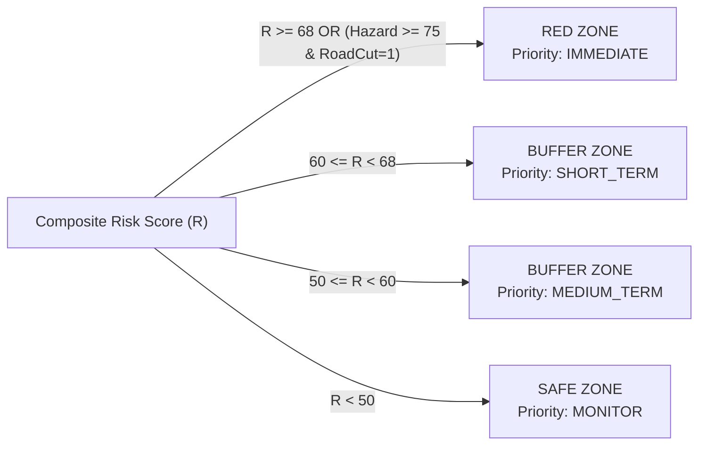

# KAVACH (कवच) — Intelligent Multi-Hazard Decision Support & Carrying Capacity Relocation Engine

> **Smart India Hackathon (SIH) — Problem Statement ID:** `26191`  
> **Problem Statement Title:** *Intelligent Identification of Hazard-Based Red Zones, Carrying Capacity Assessment, and Immediate Relocation Needs for Vulnerable Habitations*  
> **Target Beneficiaries:** National Disaster Management Authority (NDMA), State Disaster Management Authorities (SDMAs), District Disaster Management Authorities (DDMAs), NDRF/SDRF Incident Commanders, and Vulnerable Himalayan & Coastal Habitations.  
> **Pilot Region:** Dehradun & Mussoorie Basin, Uttarakhand (Himalayan Hazard Corridor).

---

## 1. Executive Summary & 30-Second Pitch

> *"Disasters do not wait for bureaucratic assessments, and relief cannot succeed on guesswork. India's disaster management has historically been **reactive**—evacuating habitations only after disaster strikes, into makeshift camps that lack carrying capacity, medical infrastructure, or safe access.*  
>  
> ***Kavach (कवच)*** *transforms disaster management from reactive relief to **proactive, AI-driven precision governance**. By combining 10-meter Copernicus Sentinel-2 satellite imagery, Sentinel-1 SAR soil moisture telemetry, ALOS PALSAR digital elevation models (DEM), and real-time IMD precipitation radar, Kavach dynamically calculates multi-hazard Red Zones, demystifies risk through **Explainable AI (XAI)**, optimizes relocation using a **capacitated carrying capacity solver**, generates legal evacuation orders under the Disaster Management Act, 2005 with one click, and broadcasts bilingual emergency warnings to citizens across Cell Broadcast (CBS), SMS, and WhatsApp."*

---

## 2. The 30-Second Core Concept & Technical Pipeline

Think of Kavach as a continuous **5-stage pipeline**:

```
[1. SATELLITE & SENSORS] ──> [2. AI MULTI-HAZARD RISK BRAIN] ──> [3. EXPLAINABLE AI (XAI)]
                                                                           │
                                                                           ▼
[5. ACTION: 3D GIS MAP + LEGAL ORDER + CITIZEN SIRENS] <── [4. CARRYING CAPACITY SOLVER]
```

### End-to-End Technical Sequence Flow

```mermaid
sequenceDiagram
    autonumber
    actor Officer as District Magistrate / DDMO
    participant UI as Next.js 16 Frontend (Mapbox 3D)
    participant API as FastAPI Backend (/api/v1)
    participant ML as MultiHazard AI Engine
    participant OPT as Relocation Capacity Solver
    participant DB as PostGIS / PostgreSQL
    actor Citizen as Citizens & NDRF Convoys

    Note over API,DB: STAGE 1: INGESTION & DATA STORAGE
    API->>DB: Query habitations, demographics & shelter capacity
    
    Note over UI,ML: STAGE 2: REAL-TIME AI RISK EVALUATION
    UI->>API: GET /settlements/ (Live telemetry evaluation)
    API->>ML: Evaluate(Rainfall, Slope, NDVI, NDWI, Demographics, Road Status)
    ML-->>API: Risk Score (0-100), Status (RED / BUFFER / SAFE), Priority (IMMEDIATE)
    API-->>UI: GeoJSON features with risk scores & color codes

    Note over UI,Officer: STAGE 3: EXPLAINABLE AI (XAI)
    Officer->>UI: Clicks "Explain Risk Factors (XAI)"
    UI-->>Officer: Shows telemetry breakdown: Slope (36°), Rain (120mm/hr), Road Cut (Yes)

    Note over UI,OPT: STAGE 4: CARRYING CAPACITY OPTIMIZER
    UI->>API: GET /analytics/relocation-plan
    API->>OPT: Optimize(Endangered Habitations, Available Shelters)
    OPT->>OPT: Run Haversine Distance + Medical Matching + Capacity Constraints
    OPT-->>API: Shelter Allocations + OSRM Route Geometry
    API-->>UI: Draw animated evacuation paths on 3D GIS Map

    Note over Officer,Citizen: STAGE 5: LEGAL ACTION & CITIZEN BROADCAST
    Officer->>UI: Clicks "Generate Evacuation Order"
    UI-->>Officer: Formatted Legal Order under DM Act 2005 (Print / PDF)
    Officer->>UI: Clicks "Citizen Broadcast (CAP)"
    UI-->>Citizen: Dispatches CBS Emergency Siren, SMS & WhatsApp in Hindi & English
```

---

## 3. Problem Statement Deconstruction (SIH PS 26191)

### 3.1 The Background & National Vulnerability
India is among the most disaster-vulnerable nations globally:
- **Landslides & Cloudbursts:** Over 12.6% of India's landmass (0.42 million sq. km) in the Himalayas and Western Ghats is prone to severe landslides. Extreme cloudburst events (>100 mm/hr) regularly trigger catastrophic debris flows in Uttarakhand, Himachal Pradesh, Sikkim, and Kerala (e.g., Kedarnath 2013, Chamoli 2021, Wayanad 2024).
- **Vulnerable Habitations in Danger Zones:** Rapid urbanization, remote mountain hamlets, and tourist corridors have left hundreds of habitations directly in active floodplains, slope toe-cutting zones, and unstable fault escarpments.
- **Relocation Gridlock:** When disasters strike, communities are evacuated haphazardly to nearby schools or community halls with zero pre-assessment of structural safety, water/sanitation capacity, or medical readiness.

### 3.2 Core Mandate of the Problem Statement
1. **Dynamic Multi-Hazard Red Zone Mapping:** Move beyond static paper maps to real-time, GIS-driven hazard identification that updates with live environmental triggers.
2. **Carrying Capacity Assessment of Alternative Relocation Sites:** Ensure designated shelters have adequate spatial capacity, water, sanitation, and medical support without exceeding threshold limits.
3. **Evidence-Based Habitational Prioritization:** Classify endangered habitations into *Immediate*, *Short-Term*, *Medium-Term*, and *Monitor* based on composite risk (physical hazard + demographic vulnerability + isolation).
4. **Actionable Insights for SDMA / DDMA:** Provide intuitive, legally defensible, and explainable decision-support interfaces for District Magistrates and disaster response teams.

---

## 4. Traditional Disaster Management vs. The Kavach Solution

| Dimension | Traditional / Existing Approach | The Kavach Innovation |
| :--- | :--- | :--- |
| **Hazard Demarcation** | **Static & Outdated:** Geological Survey of India (GSI) macro-zonation maps updated once in years; cannot respond to today's cloudburst. | **Real-Time & Telemetry-Driven:** Ingests live IMD rainfall radar (mm/hr), Sentinel-2 MSI multispectral indices, Sentinel-1 SAR soil saturation, and DEM slope gradient. |
| **Vulnerability Analysis** | **Purely Physical:** Considers only geological slope or river proximity; treats a village of 500 able-bodied youth the same as one with 60% bedridden elderly and infants. | **Socio-Physical Composite Index:** Factors in vulnerable demographics (elderly, children, disabled), road access status, and distance to nearest hospitals. |
| **Relocation Planning** | **Ad-hoc & Reactive:** Evacuation orders issued after debris hits; evacuees packed into nearest school until overcrowding and epidemics break out. | **Capacitated Carrying Capacity Solver:** Multi-objective algorithmic solver that respects shelter capacity limits, matches medical needs, and computes shortest safe routes via OSRM. |
| **Decision Transparency** | **Black-Box Skepticism:** Bureaucrats and SDMA officers hesitate to act on opaque AI scores without knowing the underlying reasons. | **Explainable AI (XAI) Modal:** Provides complete factor attribution (e.g., *Precipitation: 120 mm/hr (40% weight)*, *Slope: 36° (35% weight)*, *Road Cut: TRUE*). |
| **Administrative Action** | **Bureaucratic Latency:** Drafted manually across departments; takes 12–24 hours to issue gazetted evacuation orders. | **1-Click DDMA Legal Evacuation Order:** Instant formatted, printable order under the DM Act 2005 with allocation tables and official stamps. |
| **Citizen Early Warning** | **Loudspeakers & Word of Mouth:** Delayed, fragmented, often unreached in deep mountain valleys. | **Multi-Channel Broadcast System:** Integrates Cell Broadcast Service (CBS), SMS, WhatsApp, and IVR in Hindi and English with emergency helpline links (1077 / 112). |
| **Simulation & Stress Testing** | **None:** Systems only tested during actual catastrophic failure. | **Interactive Cloudburst / Surge Simulator:** One-click simulation of 120 mm/hr cloudburst to stress-test system dynamics and shelter overflow. |

---

## 5. Mathematical Formulations & Algorithmic Logic

### 5.1 Physical Hazard Intensity (H) [0 to 100]
Physical hazard intensity combines real-time meteorological conditions, topographical gradient, surface water pooling, canopy degradation, and historical recurrence:

```
Hazard Intensity (H) = [ 0.40 × RainFactor + 0.35 × SlopeFactor + 0.15 × SoilFactor + 0.10 × HistoryFactor ] × 100
```

Where:
- **Slope Factor:** `clamp((SlopeAngle - 10.0) / 25.0, 0, 1)`  
  *(Slopes > 25° to 35° in Himalayan scree exhibit severe non-linear shear failure risk).*
- **Precipitation Factor:** `clamp(Rainfall_mm_per_hr / 100.0, 0, 1)`  
  *(≥ 60 mm/hr triggers Himalayan cloudburst alert; ≥ 100 mm/hr is catastrophic).*
- **Soil Instability Index:**  
  `clamp(0.50 × (1 - NDVI) + 0.50 × NDWI, 0, 1)`  
  *(Loss of root canopy via low NDVI + saturated surface water pooling via high NDWI = high mudflow potential).*
- **Historical Factor:** `min(1.0, PastEvents × 0.25)`

---

### 5.2 Demographic Vulnerability Index (V) [0 to 100]
Physical hazard must be weighted by human vulnerability:

```
Vulnerability (V) = [ 0.65 × (VulnerablePopulation / TotalPopulation) + 0.35 × min(1.0, TotalPopulation / 1500) ] × 100
```

Where:
- `VulnerablePopulation = ElderlyCount + ChildrenCount + DisabledCount`

---

### 5.3 Infrastructure Isolation Index (I) [0 to 100]
A village that cannot be reached by emergency ambulances or rescue convoys faces compounding fatality risk:

```
Isolation (I) = [ 0.50 × RoadCut + 0.30 × min(1.0, HospitalDistance_km / 15.0) + 0.20 × min(1.0, ShelterDistance_km / 10.0) ] × 100
```

Where:
- `RoadCut = 1.0` if primary access road is blocked by landslide debris, else `0.0`.

---

### 5.4 Composite Risk Score (R) & Zone Classification

```
Composite Risk (R) = 0.50 × HazardIntensity + 0.30 × Vulnerability + 0.20 × Isolation
```



---

### 5.5 Capacitated Carrying Capacity Optimization Algorithm
The relocation engine solves a **Constrained Multi-Objective Spatial Allocation Problem**.

1. **Minimize Relocation Distance (Haversine Formula):**  
   Calculates great-circle distance between endangered habitation coordinates `(lat1, lon1)` and shelter coordinates `(lat2, lon2)`:
   ```
   Distance = 2 × R × arcsin( sqrt( sin²(Δlat/2) + cos(lat1) × cos(lat2) × sin²(Δlon/2) ) )
   ```
2. **Prioritize Vulnerable Cohorts:**  
   Matches habitations with > 25% vulnerable populations to shelters with operational medical relief centers (+50 affinity score bonus).
3. **Strict Capacity Constraint (Carrying Capacity):**  
   The solver enforces that allocated evacuees plus current occupancy never exceeds the shelter's structural maximum capacity:
   ```
   TotalAllocated(Shelter) + CurrentOccupancy(Shelter) ≤ MaxCapacity(Shelter)
   ```
4. **Ordering Hierarchy:**  
   Sorts habitations by: `(PriorityWeight, VulnerablePopulation, TotalPopulation)`.  
   All `IMMEDIATE` habitations are completely allocated before short-term habitations.

---

## 6. Technical Stack & Implementation Details

### Backend Architecture
- **Framework:** Python 3.12 + FastAPI (Asynchronous ASGI, OpenAPI Docs at `/docs`)
- **Database & GIS:** PostgreSQL 16 + PostGIS extension + GeoAlchemy2 + Shapely (SRID 4326 WGS84)
- **ORM & Migrations:** SQLAlchemy 2.0 (asyncio + asyncpg) + Alembic
- **Security & Auth:** OAuth2 Password Bearer + JWT (HS256) + Passlib (bcrypt password hashing) + Role-Based Access Control (`ADMIN` vs `DDMO`)
- **Routing Engine:** Open Source Routing Machine (OSRM) integration for realistic road network paths

### Frontend Architecture
- **Framework:** Next.js 16 (App Router, Server & Client Components) + React 19 + TypeScript 5.7
- **Mapping & GIS:** Mapbox GL v3.30 + `react-map-gl` + Leaflet + MapLibre GL fallback
- **Styling & UI:** Tailwind CSS v4 + Lucide React + Glassmorphism Dark Mode
- **State Management:** Reactive Client State with instant optimistic updates and modal pipelines

---

## 7. Deep Dive: Key Modules & Innovative Features

### 7.1 Dynamic Multi-Hazard Mapbox Command Center
- **Satellite & 3D Terrain:** High-resolution Mapbox satellite raster basemap with dynamic hillshading and 3D terrain pitch.
- **Color-Coded Status Markers:** Pulsing markers for `RED` (Critical), `BUFFER` (Warning), and `SAFE` (Secure).
- **Hazard Zones Polygons:** Vector polygon overlays demarcating active landslide scarps and riverbank inundation buffers.
- **Animated Evacuation Paths:** Dynamic OSRM driving routes connecting endangered habitations to designated shelters with real-time route geometry.

### 7.2 Explainable AI (XAI) Modal
- Solves the critical barrier to AI adoption in public administration: **Distrust of Black Boxes**.
- Clicking **"Explain Risk Factors"** on any settlement opens an in-depth breakdown displaying:
  - Exact satellite telemetry (Sentinel-2 NDVI, NDWI, Sentinel-1 SAR backscatter in dB).
  - Slope angle and rain rate triggers.
  - Demographic vulnerability breakdown (elderly, children, disabled counts).
  - Infrastructure isolation flags (road cut, distance to hospital).
  - Full natural-language justification for why the model designated the status.

### 7.3 Real-Time Cloudburst & Disaster Simulator
- Located on the top bar: **"Simulate Cloudburst (120 mm/hr)"** and **"Reset"**.
- Triggers the backend `/analytics/simulate-hazard` endpoint:
  - Elevates precipitation to 120 mm/hr across the Himalayan ridge.
  - Triggers road severed status on mountain access routes.
  - Dynamically recalculates composite risk: habitations like Mussoorie Ridge and Barkot escalate from `BUFFER` into `RED Zone (IMMEDIATE)`.
  - Active Red Zones count increases from **3 to 5**.
  - Automatically re-runs the carrying capacity optimizer for all ~4,000 evacuees.
  - Dispatches high-priority alerts to the live operational alert feed.
  - Clicking **"Reset"** cleanly restores baseline conditions (3 Red Zones) and removes simulated alerts.

### 7.4 Dynamic Manual Reallocation Balancing Tool
- Allows incident commanders to override or fine-tune algorithmic shelter allocations.
- Disaster managers can select an allocation (e.g., Kholi Village → Raipur Sports Complex), inspect candidate shelters with live capacity percentages, and transfer evacuees to another facility with automatic capacity recalculation and route update.

### 7.5 Official DDMA Legal Evacuation Order Engine
- Formats and generates a formal statutory order under the **Disaster Management Act, 2005 (Section 30/34)**.
- Features:
  - Official Gazette header with District Disaster Management Authority letterhead.
  - Formal executive order text with enforceable legal mandates.
  - Tabulated allocation matrix: Habitation Name, Designated Shelter, Evacuee Count, Distance, Medical Readiness.
  - District Magistrate / DDMA Chairman signature and stamp block.
  - Direct 1-Click Print & PDF export.

### 7.6 Citizen Multi-Channel Bilingual Emergency Broadcast
- Directly addresses last-mile communication failures in disaster scenarios.
- Supports **English** and **Hindi (हिन्दी)** bilingual broadcasts.
- Channels supported:
  - **Cell Broadcast Service (CBS):** High-priority emergency broadcast sirens to all mobile towers in the red zone polygon without network congestion.
  - **SMS Gateways:** Direct bulk SMS dispatch.
  - **WhatsApp Business API:** Rich message with Google Maps navigation link to designated shelter.
  - **Interactive Voice Response (IVR):** Automated voice calls for low-literacy or elderly citizens.
- Verified national emergency helplines embedded: **1077 (District Control Room)** and **112 (National Emergency)**.

---

## 8. Step-by-Step Live Demonstration Playbook (For Tomorrow's Jury)

Follow this exact sequence during your demonstration to deliver maximum impact:

```
[00:00 - 01:00] THE PROBLEM & CONTEXT
- Open on the Kavach Dashboard (http://localhost:3000).
- Explain the problem: Uttarakhand cloudbursts & reactive relocation chaos.
- Highlight the live KPI cards: Active Red Zones (3), Total Population Threatened, Available Shelter Capacity.

[01:00 - 02:30] REAL-TIME 3D GIS COMMAND CENTER
- Show the interactive map with satellite layer and 3D terrain pitch.
- Point out the red hazard polygons (Song River Basin / Maldevta scarp).
- Click on a RED village (e.g., Maldevta Habitation).
- Show the popover with risk score (91.2), population (850), and road cut status.

[02:30 - 04:00] THE EXPLAINABLE AI (XAI) BREAKDOWN
- Click the "Explain Risk Factors (XAI)" button.
- Walk the jury through the telemetry:
  * "Judges, notice this is NOT a black box. Kavach shows exactly why this is RED."
  * Point out Slope (36°), Precipitation Gauge (92 mm/hr), NDWI Soil Moisture (0.42), and Road Access: Severed.
  * Show the demographic vulnerability breakdown (290 vulnerable individuals: elderly + children).

[04:00 - 05:30] REAL-TIME CLOUDBURST SURGE SIMULATION
- Say: "Now let's simulate a sudden Himalayan cloudburst event in real-time."
- Click the amber "Simulate Cloudburst (120 mm/hr)" button in the top bar.
- Watch the system update in real-time:
  * Live emergency alert pops up in the Operations Feed: "SIMULATED EVENT: Cloudburst Surge (120 mm/hr) - CRITICAL".
  * Threatened buffer habitations (Mussoorie Ridge & Barkot) instantly upgrade from BUFFER into RED Zones with IMMEDIATE relocation priority (Active Red Zones count surges from 3 to 5!).
  * The carrying capacity optimizer automatically re-executes, dynamically routing all ~4,000 evacuees across regional shelters.
  * Click the "Reset" button to demonstrate returning seamlessly to baseline conditions (3 Red Zones).

[05:30 - 07:00] CARRYING CAPACITY SOLVER & REALLOCATION
- Navigate to the "Relocation Strategy" tab.
- Explain the shelter capacity utilization meters:
  * "Notice Parade Ground and Raipur Stadium. The system enforces strict carrying capacity constraints—no shelter exceeds 100%."
  * Show that habitations needing medical care were mapped to facilities with medical units.
  * Click "Reallocate" on one record to demonstrate manual commander override.

[07:00 - 08:30] ADMINISTRATIVE ACTION & CITIZEN BROADCAST
- Click "Generate Official Evacuation Order":
  * Show the legal DDMA document under DM Act 2005 ready for the District Magistrate's signature.
- Click "Broadcast to Citizens":
  * Toggle between English and Hindi.
  * Show the Cell Broadcast Service (CBS) emergency siren preview.
  * Click "Dispatch Emergency Broadcast" and show the live multi-channel dispatch animation.

[08:30 - 10:00] JURY Q&A & ARCHITECTURAL SUMMARY
- Conclude with tech stack: FastAPI, PostGIS, Next.js 16, Copernicus Sentinel telemetry, and OSRM routing.
```

---

## 9. Anticipated Jury Cross-Questions & Winning Responses

### Q1: *"How does your system get satellite data during heavy cloud cover when optical satellites like Sentinel-2 cannot see the ground?"*
> **Winning Answer:**  
> *"That is precisely why Kavach uses a **multi-sensor fusion architecture**. While optical sensors (Sentinel-2 MSI) provide baseline land cover and vegetation indices (NDVI), during heavy monsoon cloud cover we switch weights to **Synthetic Aperture Radar (SAR) from Sentinel-1 C-band** and **ground-based IMD Doppler weather radar**. SAR operates at microwave wavelengths (5.405 GHz) that penetrate through clouds, rain, and nighttime darkness to measure ground backscatter changes and soil moisture saturation. Together with real-time IMD radar and automated weather stations (AWS), the risk engine never goes blind."*

### Q2: *"What if the roads to the recommended shelter are blocked or damaged during the disaster?"*
> **Winning Answer:**  
> *"Our system includes an **Infrastructure Isolation Index** and live road network connectivity. In the simulation, when road access is severed, the isolation penalty immediately surges to 100%, triggering an immediate alert to NDRF for aerial reconnaissance or boat rescue. Furthermore, our routing integrates with **OSRM**, allowing local DDMO officers to mark specific road segments as impassable, forcing the optimizer to reroute evacuees via alternate mountain corridors or assign secondary staging camps."*

### Q3: *"How do you handle privacy and unauthorized users issuing false evacuation orders?"*
> **Winning Answer:**  
> *"Kavach enforces strict **Role-Based Access Control (RBAC)**. Only verified District Disaster Management Officers (`DDMO`) assigned to that specific district can generate evacuation orders for their jurisdiction, and all actions are cryptographically logged in an **immutable audit trail table (`audit_logs`)** with timestamps, user IDs, and IP addresses. State or National Admins can oversee cross-district deployments, but unauthorized users cannot trigger broadcasts or modify allocations."*

### Q4: *"Can this scale beyond Uttarakhand to the entire country?"*
> **Winning Answer:**  
> *"Yes. The underlying geospatial engine is built on **PostgreSQL with PostGIS** and standard WGS84 coordinates. The administrative hierarchy is fully normalized (State → District → Block → Gram Panchayat → Settlement). Ingesting a new state like Kerala, Himachal Pradesh, or coastal Odisha only requires importing their administrative shapefile and census records. The multi-hazard engine formulas automatically generalize across terrain types."*

### Q5: *"Why not use a standard deep learning black-box model instead of an explainable scoring formula?"*
> **Winning Answer:**  
> *"In public administration and disaster law, an unexplainable black box is an operational liability. Under Section 30 of the Disaster Management Act, 2005, a District Magistrate cannot order the forcible evacuation of thousands of citizens based on an opaque probability score without knowing the physical and demographic factors. Kavach's **Explainable AI architecture** provides verifiable mathematical weights that can be defended in court, scrutinized by geologists, and audited by administrative oversight."*

---

## 10. Credentials & Quick Run Guide for Demo

### Running Ports:
- **Frontend Dashboard:** `http://localhost:3000` (Next.js 16)
- **Backend API & Swagger Docs:** `http://localhost:8000/docs` (FastAPI)

### Pre-Configured Demo Credentials:
| Role | Email | Password | Scope |
| :--- | :--- | :--- | :--- |
| **National Administrator** | `admin@kavach.gov.in` | `KavachAdmin@2026` | Full Pan-India System Access |
| **District Officer (DDMO)** | `ddmo.dehradun@kavach.gov.in` | `DehradunDDMO@2026` | Dehradun District Operational Control |

### Terminal Commands to Start (if restarted):
```bash
# Terminal 1: Backend
cd d:\kavach\backend
python -m uvicorn app.main:app --host 127.0.0.1 --port 8000 --reload

# Terminal 2: Frontend
cd d:\kavach\frontend
npm run dev
```

---

## 11. Conclusion & Vision

Kavach fulfills every requirement of **SIH Problem Statement 26191**:
1. **Dynamic Red Zone Identification:** Real-time multi-hazard risk engine powered by earth observation.
2. **Carrying Capacity Assessment:** Algorithmic solver ensuring safe, un-crowded, medically supported relocation.
3. **Evidence-Based Prioritization:** Triaged intervention timeline (Immediate, Short-Term, Medium-Term).
4. **Actionable Government Platform:** From satellite pixel to signed administrative order and citizen siren in seconds.

**Kavach stands ready for live demonstration and national deployment.**
